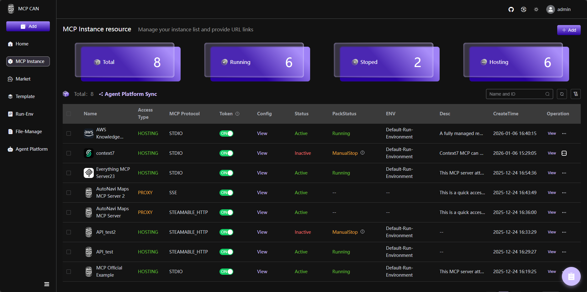

<div align="center">
  

</div>

<div align="center">

# MCP CAN

The open source integration platform for MCP Server.</br>
MCPCAN uses containers for flexible deployment of MCP services, resolving potential system configuration conflicts. It supports multi-protocol compatibility and conversion, enabling seamless integration between different MCP service architectures. It also provides visual monitoring, security authentication, and one-stop deployment capabilities.</br>

  
  
  
  
  
</div>
<p align="center">
   <strong>English</strong> | <a href="./README_CN.md">中文版</a> <br>
   <a href="https://demo.mcpcan.com">DemoSite : demo.mcpcan.com（login: admin/admin123）</a> | <a href="https://www.mcpcan.com">MainSite : www.mcpcan.com</a><br>
   <a href="https://www.mcpcan.com/docs/en/guide/welcome
   "><u>Document</a></u>
</p>
<p align="center">
    <a href="https://demo.mcpcan.com" target="_blank">
        </a>
    <a href="https://dify.ai/pricing" target="_blank">
        </a>
    <a href="https://discord.gg/EegGj7G7Bz" target="_blank">
        </a>
    <a href="https://twitter.com/intent/follow?screen_name=MCPCAN" target="_blank">
        </a>
</p>

MCPCan is an open-source platform focused on efficient management of MCP (Model Context Protocol) services, providing DevOps and development teams with comprehensive MCP service lifecycle management capabilities through a modern web interface.
MCPCan supports multi-protocol compatibility and conversion, enabling seamless integration between different MCP service architectures while providing visual monitoring, security authentication, and one-stop deployment capabilities.

## 💡 Introduction

MCPCan is an open-source platform focused on efficient management of MCP (Model Context Protocol) services, providing DevOps and development teams with comprehensive MCP service lifecycle management capabilities through a modern web interface.
MCPCan supports multi-protocol compatibility and conversion, enabling seamless integration between different MCP service architectures while providing visual monitoring, security authentication, and one-stop deployment capabilities.<br/>

## ✨ Core Features

- **🎯 Unified Management**: Centralized management of all MCP service instances and configurations
- **🔄 Protocol Conversion**: Supports seamless conversion between various MCP protocols
- **📊 Real-time Monitoring**: Provides detailed service status and performance monitoring data
- **🔐 Security Authentication**: Built-in identity authentication and permission management system
- **🚀 One-stop Deployment**: Quick release, configuration, and distribution of MCP services
- **📈 Scalability**: Cloud-native architecture based on Kubernetes

## ✨ Demo and Official Website

For the best demo experience, try directly <a href="https://demo.mcpcan.com">DemoSite : demo.mcpcan.com（login: admin/admin123）</a>.<br>
</video>
Watch our demo video on Bilibili: <a href="https://www.bilibili.com/video/BV1htBXBbECr?t=3.2">BV1htBXBbECr</a><br>
To view our official website address, simply click <a href="https://www.mcpcan.com">MainSite : www.mcpcan.com</a>.

## 👨‍🚀 Quick Start

For detailed deployment instructions, please refer to our [Deployment Guide](https://www.mcpcan.com/docs/en/guide/install).

### 1. Get Deployment Repository

```bash
# GitHub (International)
git clone https://github.com/Kymo-MCP/mcpcan-deploy.git
cd mcpcan-deploy/docker-compose/

# Gitee (Recommended for China)
git clone https://gitee.com/kymomcp/mcpcan-deploy.git
cd mcpcan-deploy/docker-compose/
```

### 2. Start Services

**Docker Compose Quick Start (Recommended)**

Suitable for local development, testing, and lightweight production deployments.

```bash
# 1. Initialize configuration
cp example.env .env
# (Optional) Modify .env file for settings like REGISTRY_PREFIX to switch between global/CN mirrors

# 2. Generate final configuration
chmod +x replace.sh
./replace.sh

# 3. Start services
docker compose up -d

# 4. Access Web UI
Login: admin/admin123
```

After successful installation, access `http://localhost` (or `http://<Your Public IP>`) to start using.

**Helm Installation**

Suitable for Kubernetes environment deployment, please refer to [Helm Deployment Guide](https://kymo-mcp.github.io/mcpcan-deploy/).

## 🚀 Components

MCPCan consists of multiple key components, which collectively form the functional framework of MCPCan, providing users with comprehensive MCP service management capabilities.

| Project                                | Status                                                      | Description                                |
| -------------------------------------- | ----------------------------------------------------------- | ------------------------------------------ |
| [MCPCan-Web](frontend/)                |  | MCPCan Web UI (Vue.js Frontend)            |
| [MCPCan-Backend](backend/)             |  | MCPCan Backend Services (Go Microservices) |
| [MCPCan-Gateway](backend/cmd/gateway/) |  | MCP Gateway Service                        |
| [MCPCan-Market](backend/cmd/market/)   |  | MCP Service Marketplace                    |
| [MCPCan-Authz](backend/cmd/authz/)     |  | Authentication and Authorization Service   |

## 🐧 Technology Stack

### 🐧 Frontend

- **Framework**: Vue.js 3.5+ (Composition API)
- **Language**: TypeScript
- **Styling**: UnoCSS, SCSS
- **UI Components**: Element Plus
- **State Management**: Pinia
- **Build Tool**: Vite

### 🐧 Backend

- **Language**: Go 1.24.2+
- **Framework**: Gin, gRPC
- **Database**: MySQL, Redis
- **Containerization Tools**: Docker, Kubernetes

## 🐧 Third-party Projects

- [mcpcan-deploy](https://github.com/Kymo-MCP/mcpcan-deploy) - Official Helm Charts source repository for MCPCan
- [MCPCan Helm Charts](https://kymo-mcp.github.io/mcpcan-deploy/) - Official Helm charts repository for MCPCan

## 💝 Contributing Guide

Welcome to submit PR to contribute! Please refer to [Contributing](CONTRIBUTING.md) for detailed guidelines.

Before contributing, please ensure:

1. Read our [Code of Conduct](CODE_OF_CONDUCT.md)
2. Check existing issues and pull requests (avoid duplicate work)
3. Follow our coding standards and commit message conventions

## ✅ Security

If you discover a security vulnerability, please refer to our [Security Policy](SECURITY.md) for responsible disclosure guidelines.

## 📄 License

Copyright (c) 2024-2025 MCPCan Team, All rights reserved.

This software is licensed under the Apache License Version 2.0 (the "License"); you may not use this file except in compliance with the License. You may obtain a copy of the License at

http://www.apache.org/licenses/LICENSE-2.0

Unless required by applicable law or agreed to in writing, software distributed under the License is distributed on an "AS IS" BASIS, WITHOUT WARRANTIES OR CONDITIONS OF ANY KIND, either express or implied. See the License for the specific language governing permissions and limitations under the License.

## 👥 Community & Support

- 📖 [Documentation](https://kymo-mcp.github.io/mcpcan-deploy/)
- 💬 [Discord Community](https://discord.com/channels/1428637640856571995/1428637896532820038)
- 🐛 [Issue Tracker](https://github.com/Kymo-MCP/mcpcan/issues)
- 📧 [Mailing List](mailto:opensource@kymo.cn)
- 🌐 WeChat<br>
  

## 💕 Acknowledgments

- Thanks to the [MCP Protocol](https://modelcontextprotocol.io/) community
- Thanks to all contributors and supporters
- Special thanks to the open-source projects that make MCPCan possible

## 🌟 Star History

[](https://www.star-history.com/#Kymo-MCP/mcpcan&type=date&legend=top-left)
