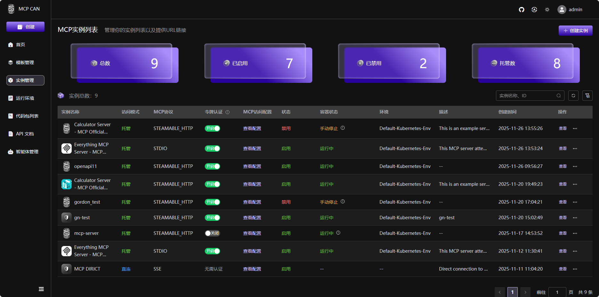

<div align="center">
  
</div>

<div align="center">

<div align="center">

# MCP CAN

开源的MCP服务器集成平台。</br>
MCPCAN使用容器实现MCP服务的灵活部署，解决潜在的系统配置冲突。它支持多协议兼容与转换，实现不同MCP服务架构之间的无缝集成。它还提供可视化监控、安全认证和一站式部署功能。</br>

  
  
  
  
  
</div>
<p align="center">
   <a href="./README.md">English</a> | <strong>中文版</strong> <br>
   <a href="https://demo.mcpcan.com">DemoSite : demo.mcpcan.com</a> | <a href="https://www.mcpcan.com">MainSite : www.mcpcan.com</a><br>
   <a href="https://www.mcpcan.com/docs/en/guide/welcome
   "><u>Document</a></u>
</p>
<p align="center">
    <a href="https://demo.mcpcan.com" target="_blank">
        </a>
    <a href="https://dify.ai/pricing" target="_blank">
        </a>
    <a href="https://discord.gg/EegGj7G7Bz" target="_blank">
        </a>
    <a href="https://twitter.com/intent/follow?screen_name=MCPCAN" target="_blank">
        </a>
</p>

MCPCan是一个专注于高效管理MCP（模型上下文协议）服务的开源平台，通过现代化的Web界面，为DevOps和开发团队提供全面的MCP服务生命周期管理功能。
MCPCan支持多协议兼容和转换，实现不同MCP服务架构之间的无缝集成，同时提供可视化监控、安全认证和一站式部署功能。

## 💡 介绍

MCPCan是一个专注于高效管理MCP（模型上下文协议）服务的开源平台，通过现代化的Web界面，为DevOps和开发团队提供全面的MCP服务生命周期管理功能。
MCPCan支持多协议兼容和转换，实现不同MCP服务架构之间的无缝集成，同时提供可视化监控、安全认证和一站式部署功能。<br/>

## ✨ 核心功能

- **🎯 统一管理**：集中管理所有MCP服务实例及配置项
- **🔄 协议转换**：支持多种MCP协议间无缝互转
- **📊 实时监控**：提供详尽的服务状态与性能监控数据
- **🔐 安全认证**：内置身份认证与权限管理体系
- **🚀 一站式部署**：MCP服务快速发布、配置与分发
- **📈 可扩展性**：基于Kubernetes的云原生架构

## ✨演示和官网

为了获得最佳演示体验，请尝试直接 <a href="https://demo.mcpcan.com">DemoSite : demo.mcpcan.com</a>。<br>
[MP4]<br>
要查看我们的官方网站地址，只需点击 <a href="https://www.mcpcan.com">MainSite : www.mcpcan.com</a>。

## 👨‍🚀快速开始

有关详细部署说明，请参阅我们的[部署指南](https://kymo-mcp.github.io/mcpcan-deploy/)。

### 1. 获取部署仓库

```bash
# GitHub (国际)
git clone https://github.com/Kymo-MCP/mcpcan-deploy.git
cd mcpcan-deploy

# Gitee (中国推荐)
git clone https://gitee.com/kymomcp/mcpcan-deploy.git
cd mcpcan-deploy
```

### 2. 安装

**快速安装（推荐）**

适用于干净的Linux服务器。自动安装k3s、ingress-nginx、Helm，并部署MCPCAN平台。

```bash
# 标准安装（国际镜像）
./scripts/install-fast.sh

# 加速安装（中国镜像）
./scripts/install-fast.sh --cn
```

安装成功后，访问 `http://<Your Public IP>` 开始使用。

**自定义安装（Helm）**

适用于需要自定义域名、HTTPS或修改默认配置的场景。

```bash
# 1. 安装依赖（如果k3s/Helm已安装则跳过）
./scripts/install-run-environment.sh       # 国际镜像
# ./scripts/install-run-environment.sh --cn  # 中国镜像

# 2. 复制并修改配置
cp helm/values.yaml helm/values-custom.yaml
# 编辑helm/values-custom.yaml设置global.domain等参数

# 3. 安装平台
helm install mcpcan ./helm -f helm/values-custom.yaml \
  --namespace mcpcan --create-namespace --timeout 600s --wait
```

## 🚀组件

MCPCan由多个关键组件构成，这些组件共同构成MCPCan的功能框架，为用户提供全面的MCP服务管理功能。

| Project                                | Status                                                      | Description                                |
| -------------------------------------- | ----------------------------------------------------------- | ------------------------------------------ |
| [MCPCan-Web](frontend/)                |  | MCPCan Web UI (Vue.js Frontend)            |
| [MCPCan-Backend](backend/)             |  | MCPCan Backend Services (Go Microservices) |
| [MCPCan-Gateway](backend/cmd/gateway/) |  | MCP Gateway Service                        |
| [MCPCan-Market](backend/cmd/market/)   |  | MCP Service Marketplace                    |
| [MCPCan-Authz](backend/cmd/authz/)     |  | Authentication and Authorization Service   |

## 🐧技术栈

### 🐧前端

- **框架**：Vue.js 3.5+（组合式API）
- **语言**：TypeScript
- **样式方案**：UnoCSS、SCSS
- **UI组件库**：Element Plus
- **状态管理**：Pinia
- **构建工具**：Vite

### 🐧后端

- **语言**：Go 1.24.2+
- **框架**：Gin、gRPC
- **数据库**：MySQL、Redis
- **容器化工具**：Docker、Kubernetes

## 🐧第三方项目

- [mcpcan-deploy](https://github.com/Kymo-MCP/mcpcan-deploy) - MCPCan的官方Helm Charts源代码库
- [MCPCan Helm Charts](https://kymo-mcp.github.io/mcpcan-deploy/) - MCPCan的官方Helm图表库

## 💝 贡献指南

欢迎提交PR参与贡献！请参考[贡献](CONTRIBUTING.md)查看详细指引。

贡献前，请确保：

1. 阅读我们的[行为准则](CODE_OF_CONDUCT.md)
2. 检查现有issue和拉取请求（避免重复工作）
3. 遵循我们的编码规范和提交信息约定

## ✅ 安全

若发现安全漏洞，请参考我们的[安全政策](SECURITY.md)，按照负责任的披露准则进行报告。

## 📄 许可证

版权所有 (c) 2024-2025 MCPCan团队，保留所有权利。

本软件基于Apache许可证第2.0版（以下简称“许可证”）授权；除非遵守许可证规定，否则不得使用本文件。您可通过以下链接获取许可证副本：

http://www.apache.org/licenses/LICENSE-2.0

除非适用法律要求或书面同意，否则根据许可证分发的软件均按“原样”提供，不附带任何明示或暗示的担保或条件。请查看许可证以了解具体的权限和限制条款。

## 👥社区与支持

- 📖 [文档](https://kymo-mcp.github.io/mcpcan-deploy/)
- 💬 [Discord社区](https://discord.com/channels/1428637640856571995/1428637896532820038)
- 🐛 [问题追踪](https://github.com/Kymo-MCP/mcpcan/issues)
- 📧 [邮件列表](mailto:opensource@kymo.cn)
- 🌐 微信<br>
 

## 💕 致谢

- 感谢[MCP协议](https://modelcontextprotocol.io/)社区
- 感谢所有贡献者和支持者
- 特别致谢使MCPCan项目成为可能的开源项目
## 🌟 Star历史

[](https://www.star-history.com/#Kymo-MCP/mcpcan&type=date&legend=top-left)
